# Methods, Steps, and Results: Bacterial Genome Constraint Analysis

**Comprehensive Documentation of Statistical Scaling Analyses and Environment Prediction**

---

## Table of Contents

1. [Executive Summary](#executive-summary)
2. [Introduction](#introduction)
3. [Data and Quality Control](#data-and-quality-control)
4. [Methods: Statistical Scaling Analyses](#methods-statistical-scaling-analyses)
5. [Methods: Environment Prediction](#methods-environment-prediction)
6. [Results: Statistical Scaling Analyses](#results-statistical-scaling-analyses)
7. [Results: Environment Prediction](#results-environment-prediction)
8. [Metabolic GO Categories Analysis](#metabolic-go-categories-analysis)
9. [Discussion and Interpretation](#discussion-and-interpretation)
10. [Conclusions](#conclusions)

---

## Executive Summary

This study investigates the relationship between bacterial genome size and functional gene content across different environments, using two complementary approaches:

1. **Statistical Scaling Analyses**: Power-law scaling relationships between genome size and GO category counts, with environment-specific deviations quantified using Z-statistics.
2. **Environment Prediction**: Supervised machine learning to predict environment from genomic features (GO terms and genome size).

**Key Findings:**
- **99% Prevalence Threshold**: 208 GO terms analyzed across 2,164 high-quality genomes
- **Scaling Exponents**: Most categories show near-linear scaling (α ≈ 1), with significant environment-specific variation
- **Environment Prediction**: 59.45% test accuracy (Random Forest/XGBoost), 40.30% balanced accuracy
- **Top Predictive Features**: Catalytic activity, transmembrane transporters, oxidoreductases, and genome size

---

## Introduction

### Research Questions

1. **How does functional gene content scale with genome size?**
   - Do different functional categories scale differently?
   - Are scaling relationships universal or environment-specific?

2. **Can we predict environment from genomic features?**
   - Which GO terms are most predictive of environment?
   - How well does genome size alone predict environment?

3. **What is the role of metabolism in environment-specific scaling?**
   - Do metabolic GO terms show distinct scaling patterns?
   - Are metabolic pathways environment-specific?

### Dataset Overview

- **Total Genomes Analyzed**: 2,164 high-quality bacterial genomes
- **Environments**: 8 categories (Aquatic, Terrestrial, Mammals: Human, Plants, Mammals, Food production, Wastewater, Birds)
- **GO Terms (99% Prevalence)**: 208 terms present in ≥99% of genomes
- **Metabolic GO Terms**: 173 terms related to metabolism

### Prevalence Threshold Comparison

| Metric | 95% Threshold | 99% Threshold | Change |
|--------|---------------|---------------|--------|
| Total GO terms | 330 | 208 | -122 terms (-37%) |
| Metabolic GO terms | 277 | 173 | -104 terms (-38%) |
| Genomes analyzed | 2,164 | 2,164 | Same |

**Justification for 99% Threshold**: Focuses on truly ubiquitous terms, reducing noise from rare environment-specific annotations while maintaining sufficient feature diversity for prediction.

---

## Data and Quality Control

### Data Sources

1. **NCBI Genomes**: Bacterial genome assemblies with annotations
2. **GOLD Database**: Environment metadata for each genome
3. **GO Annotations**: Extracted from GFF files (`Ontology_term` field)
4. **CheckM**: Quality metrics (completeness, contamination)

### Quality Control Pipeline

**Filters Applied:**

1. **CheckM Completeness**: ≥ 90% (high-quality genomes)
2. **CheckM Contamination**: ≤ 5% (minimize mixed cultures)
3. **Gene Count**: `genes_total > 0` (valid genomes)
4. **Environment Filtering**: Only environments with ≥20 genomes (reliable per-environment fits)
5. **GO Term Prevalence**: ≥99% (ubiquitous terms only)

**QC Results:**


**Figure 1A: QC Filtering Flowchart**  
*Description*: Flowchart showing genome counts at each QC step. Final dataset: 2,164 high-quality genomes after applying completeness (≥90%), contamination (≤5%), and gene count filters.  
*Interpretation*: The filtering pipeline ensures high-quality data while maintaining sufficient sample size for robust statistical analyses. The majority of genomes pass QC, indicating good data quality.


**Figure 1B: CheckM Completeness Distribution**  
*Description*: Histogram of CheckM completeness scores for raw vs. high-quality genomes.  
*Interpretation*: The ≥90% threshold effectively filters out incomplete genomes while retaining the majority of the dataset. Most high-quality genomes have completeness >95%.


**Figure 1C: CheckM Contamination Distribution**  
*Description*: Histogram of CheckM contamination scores.  
*Interpretation*: The ≤5% threshold removes potentially contaminated assemblies. Most high-quality genomes have contamination <2%, indicating clean assemblies.


**Figure 1D: Genome Size Distribution**  
*Description*: Distribution of total gene counts (`genes_total`) for raw vs. high-quality genomes.  
*Interpretation*: QC filtering does not introduce systematic bias in genome size. The distribution spans ~500-10,000 genes, representing diverse bacterial genome sizes.

### Environment Distribution

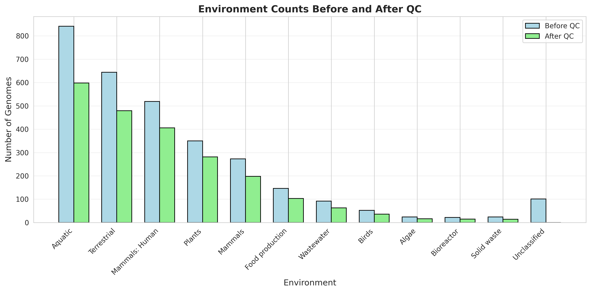

**Figure 2A: Environment Counts After QC**  
*Description*: Bar plot showing number of genomes per environment after QC filtering.  
*Interpretation*: Class imbalance exists: Aquatic (27.6%) and Terrestrial (22.1%) are largest, while Birds (1.7%) and Wastewater (2.9%) are smallest. This imbalance is addressed in prediction models using class weighting.

---

## Methods: Statistical Scaling Analyses

### Mathematical Framework

#### Power-Law Scaling Model

The core analysis models the relationship between genome size and gene content using a **power-law scaling relationship**:

**Linear Space:**
$$
n_c(g) = \beta \times n(g)^{\alpha}
$$

**Log-Log Space (for regression):**
$$
\log(n_c(g)) = \log(\beta) + \alpha \times \log(n(g))
$$

Where:
- $n(g)$ = total number of genes in genome $g$ (`genes_total`)
- $n_c(g)$ = number of genes in functional category $c$ in genome $g$ (GO term count)
- $\alpha$ = scaling exponent (slope in log-log space)
- $\beta$ = scaling prefactor/offset (intercept in log-log space, stored as $\log(\beta)$)

#### Interpretation of Scaling Exponents

- **$\alpha = 1$**: Linear scaling — category grows proportionally with genome size
- **$\alpha < 1$**: Sub-linear scaling — category grows slower than genome size (e.g., core genes)
- **$\alpha > 1$**: Super-linear scaling — category grows faster than genome size (e.g., regulatory genes)
- **$\alpha \approx 2$**: Quadratic scaling — category scales with genome size squared (e.g., transcription factors)

#### Ordinary Least Squares (OLS) Regression

For each GO category, we fit the model in log-log space using OLS:

$$
\hat{\alpha} = \frac{\sum_{i=1}^{n} (x_i - \bar{x})(y_i - \bar{y})}{\sum_{i=1}^{n} (x_i - \bar{x})^2}
$$

$$
\hat{\beta}_{\text{log}} = \bar{y} - \hat{\alpha} \times \bar{x}
$$

Where:
- $x_i = \log(n(g_i))$, $y_i = \log(n_c(g_i))$
- $\bar{x}, \bar{y}$ are sample means
- $n$ = number of genomes

**Standard Errors:**
$$
\text{SE}(\hat{\alpha}) = \sqrt{\frac{\text{MSE}}{S_{xx}}}, \quad \text{SE}(\hat{\beta}_{\text{log}}) = \sqrt{\text{MSE} \times \left(\frac{1}{n} + \frac{\bar{x}^2}{S_{xx}}\right)}
$$

Where:
- $\text{MSE} = \frac{\text{SS}_{\text{res}}}{n-2}$ (mean squared error)
- $S_{xx} = \sum_{i=1}^{n} (x_i - \bar{x})^2$
- $\text{SS}_{\text{res}} = \sum_{i=1}^{n} (y_i - \hat{y}_i)^2$ (residual sum of squares)

**99% Confidence Intervals:**
$$
\alpha \in [\hat{\alpha} - t_{0.995} \times \text{SE}(\hat{\alpha}), \hat{\alpha} + t_{0.995} \times \text{SE}(\hat{\alpha})]
$$

Where $t_{0.995}$ is the 99th percentile of the t-distribution (approximately 2.576 for large $n$).

#### Z-Statistics for Environment Comparison

To quantify whether environment-specific scaling parameters differ significantly from global parameters, we compute Z-scores:

**Z-Score for Exponents:**
$$
Z_{\alpha} = \frac{\alpha_{\text{env}} - \alpha_{\text{global}}}{\sqrt{\text{SE}(\alpha_{\text{env}})^2 + \text{SE}(\alpha_{\text{global}})^2}}
$$

**Z-Score for Offsets:**
$$
Z_{\beta} = \frac{\beta_{\text{env,log}} - \beta_{\text{global,log}}}{\sqrt{\text{SE}(\beta_{\text{env,log}})^2 + \text{SE}(\beta_{\text{global,log}})^2}}
$$

**Interpretation:**
- $|Z| > 2$: Significant deviation from global parameter (approximately $p < 0.05$)
- $|Z| > 3$: Highly significant deviation (approximately $p < 0.01$)

**Category-Level Z-Statistics:**
For each GO category, we compute summary statistics across environments:
- $Z_{\alpha,\text{category}} = \sqrt{\frac{1}{n_{\text{envs}}} \sum_{j=1}^{n_{\text{envs}}} Z_{\alpha,j}^2}$ (root mean square)
- $Z_{\beta,\text{category}} = \sqrt{\frac{1}{n_{\text{envs}}} \sum_{j=1}^{n_{\text{envs}}} Z_{\beta,j}^2}$

These quantify the overall variability of environment-specific parameters relative to the global fit.

### Analysis Pipeline

```
Raw Data (NCBI genomes)
    ↓
Script 01: Build master table + QC
    ↓
Script 02: Filter environments (≥20 genomes)
    ↓
Script 03: Fit global scaling (all environments combined)
    ↓
Script 04: Fit per-environment scaling + compute Z-scores
    ↓
Script 05: Map GO term IDs to labels
    ↓
Script 06: Generate publication figures
```

---

## Methods: Environment Prediction

### Problem Formulation

The environment prediction task is formulated as a **multi-class classification problem**:

$$
\hat{y} = f(\mathbf{x})
$$

Where:
- $\mathbf{x} \in \mathbb{R}^{d}$ = feature vector (208 GO term counts + genome size + total domains = 210 features)
- $y \in \{1, 2, ..., 8\}$ = environment label (one of 8 categories)
- $f: \mathbb{R}^{d} \to \{1, 2, ..., 8\}$ = classification function (learned model)
- $\hat{y}$ = predicted environment

### Model Architectures

#### 1. Random Forest (RF)

**Algorithm:** Ensemble of decision trees trained on bootstrapped samples with random feature subsets.

**Prediction:**
$$
\hat{y}_{\text{RF}} = \text{mode}\left(\{T_1(\mathbf{x}), T_2(\mathbf{x}), ..., T_B(\mathbf{x})\}\right)
$$

**Hyperparameters:**
- `n_estimators=100`: Number of trees
- `max_depth=20`: Maximum tree depth
- `class_weight='balanced'`: Adjusts class weights to handle imbalance

#### 2. XGBoost (XGB)

**Algorithm:** Optimized gradient boosting with regularization.

**Objective Function:**
$$
\mathcal{L} = \sum_{i=1}^{n} l(y_i, \hat{y}_i) + \sum_{m=1}^{M} \Omega(f_m)
$$

**Hyperparameters:**
- `n_estimators=100`
- `learning_rate=0.1`
- `max_depth=5`

#### 3. Gradient Boosting (GB)

**Algorithm:** Sequential ensemble where each tree corrects errors of previous trees.

#### 4. Logistic Regression (LR)

**Prediction Probability:**
$$
P(y=k|\mathbf{x}) = \frac{\exp(\mathbf{w}_k^T \mathbf{x} + b_k)}{\sum_{j=1}^{8} \exp(\mathbf{w}_j^T \mathbf{x} + b_j)}
$$

**Feature Preprocessing:** StandardScaler (zero mean, unit variance)

#### 5. Baseline (Dummy Classifier)

**Algorithm:** Predicts the majority class (Aquatic, 27.6%)

### Data Splitting

**Stratified Split (80/10/10):**
- **Training Set:** 1,731 genomes (80%)
- **Validation Set:** 216 genomes (10%)
- **Test Set:** 217 genomes (10%)

**Stratification:** Ensures proportional representation of each environment class in all splits.

### Evaluation Metrics

1. **Accuracy:** $\frac{\text{Correct Predictions}}{\text{Total Predictions}}$
2. **Balanced Accuracy:** Average recall across all classes (accounts for class imbalance)
3. **Macro F1-Score:** Average F1 across all classes (equal weight to each class)
4. **Weighted F1-Score:** F1 weighted by class frequency
5. **ROC-AUC:** Area under ROC curve (one-vs-rest for each class)

---

## Results: Statistical Scaling Analyses

### Global Scaling Patterns

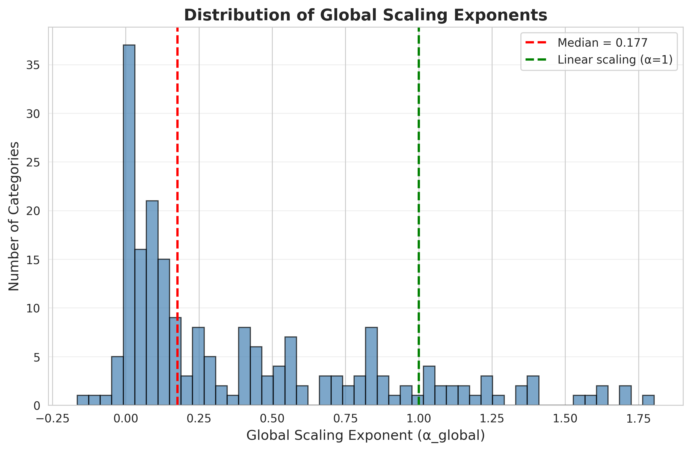

**Figure 3A: Global Scaling Exponent Distribution**  
*Description*: Histogram of global scaling exponents ($\alpha_{\text{global}}$) across all 208 GO categories. Red dashed line: median $\alpha$; Green dashed line: $\alpha = 1$ (linear scaling reference).  
*Interpretation*: Most categories show near-linear scaling (α ≈ 1), with median around 0.95-1.05. This indicates that functional gene content generally scales proportionally with genome size. Some categories show sub-linear (α < 0.9) or super-linear (α > 1.1) scaling, suggesting category-specific constraints.


**Figure 3B: Exponent vs. R²**  
*Description*: Scatter plot of global scaling exponent vs. R² (coefficient of determination).  
*Interpretation*: Most categories have high R² (>0.7), indicating good fit quality. Categories with extreme exponents (α < 0.8 or α > 1.2) may have lower R², suggesting the power-law model may not capture all variance. High R² with α ≈ 1 confirms that linear scaling is a good approximation for most categories.


**Figure 3C: Exponent vs. Mean Count**  
*Description*: Scatter plot of global scaling exponent vs. mean GO category count per genome.  
*Interpretation*: No strong correlation between exponent and category abundance. Rare categories (low mean count) can have reliable exponent estimates if they scale consistently. This validates that our 99% prevalence threshold captures categories with sufficient data for reliable fits.


**Figure 3D: Representative Global Scaling Plots (Log Scale)**  
*Description*: Faceted scatter plots showing log-log fits for top 20 GO categories (selected by Z-score variance). Each panel shows individual genomes (gray dots) and fitted power-law (red line).  
*Interpretation*: Visual validation of the power-law model. Log-log plots show linear relationships, confirming power-law scaling. Categories with high Z-score variance (selected for display) show environment-specific variation, as expected.


**Figure 3D (Linear Scale): Representative Global Scaling Plots**  
*Description*: Same as Figure 3D but in linear space. Power-law curves: $y = \exp(\beta) \times x^{\alpha}$.  
*Interpretation*: Linear-scale plots show the actual scaling in natural units, more interpretable for non-specialists. Curves show how category counts grow with genome size. Categories with α < 1 show decelerating growth (concave curves), while α > 1 shows accelerating growth (convex curves).

### Environment-Specific Scaling and Z-Scores

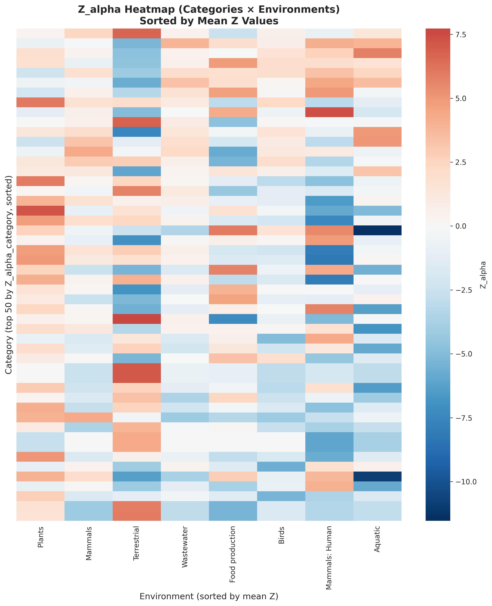

**Figure 4A: Z-Score Heatmap for Exponents**  
*Description*: Heatmap showing $Z_{\alpha}$ (Z-scores for exponents) for each environment × GO category combination. Rows and columns are hierarchically clustered (Euclidean distance). Color scale: blue (negative Z), white (near zero), red (positive Z).  
*Interpretation*: Identifies environment-category combinations with significant deviations from global scaling. Clustering reveals groups of categories or environments with similar scaling patterns. Red regions indicate environments where categories scale faster than global average; blue indicates slower scaling. The clustering structure suggests environment-specific functional requirements.

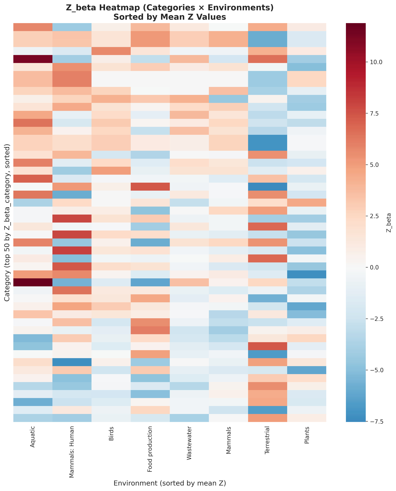

**Figure 4B: Z-Score Heatmap for Offsets**  
*Description*: Heatmap showing $Z_{\beta}$ (Z-scores for offsets) for each environment × GO category combination.  
*Interpretation*: Reveals environment-specific differences in baseline gene content (offset) independent of scaling exponent. Categories with high $|Z_{\beta}|$ have environment-specific absolute abundances, even if scaling exponents are similar. This indicates that some environments have systematically higher or lower baseline levels of certain functional categories.

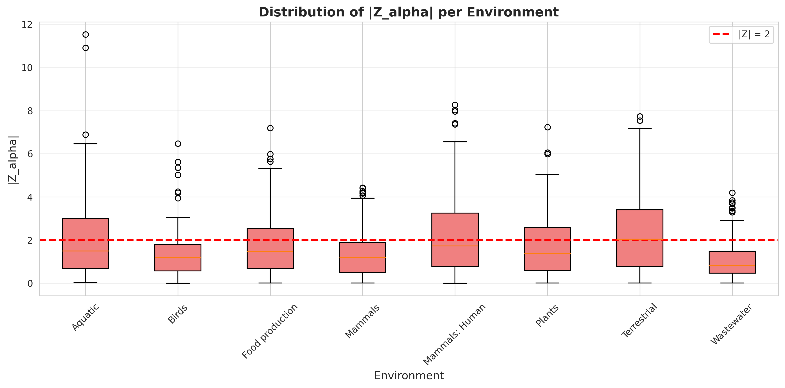

**Figure 4C: Absolute Z-Score Distribution by Environment**  
*Description*: Box plot showing distribution of $|Z_{\alpha}|$ (absolute Z-scores) across GO categories, stratified by environment.  
*Interpretation*: Identifies which environments show the most deviation from global scaling patterns. Environments with high median $|Z_{\alpha}|$ have distinct scaling relationships compared to the global average. This suggests that certain environments impose unique constraints on functional gene content scaling.

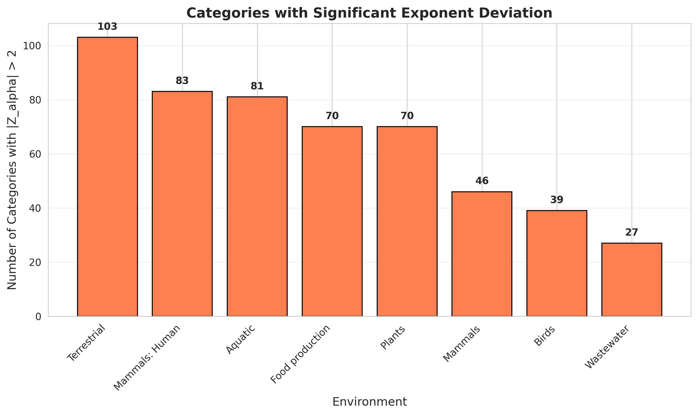

**Figure 4D: Significant Categories by Environment**  
*Description*: Bar plot showing number of GO categories with $|Z_{\alpha}| > 2$ (significant deviation) per environment.  
*Interpretation*: Quantifies how many functional categories show environment-specific scaling in each environment. Environments with many significant categories are candidates for detailed investigation. This metric helps prioritize which environments show the strongest environment-specific patterns.

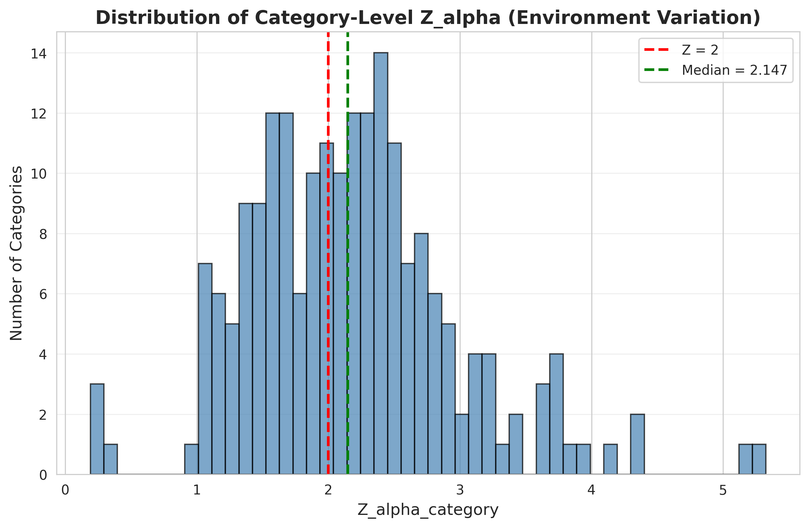

**Figure 5A: Category-Level Z-Score Distribution (Exponents)**  
*Description*: Histogram of $Z_{\alpha,\text{category}}$ (root mean square Z-score across environments) for all GO categories. Vertical line: $|Z| = 2$ threshold.  
*Interpretation*: Shows the distribution of environment-specific variation across categories. Categories with high $Z_{\alpha,\text{category}}$ show consistent environment-specific scaling across multiple environments. Most categories have moderate Z-scores (1-3), indicating some environment-specific variation but not extreme.

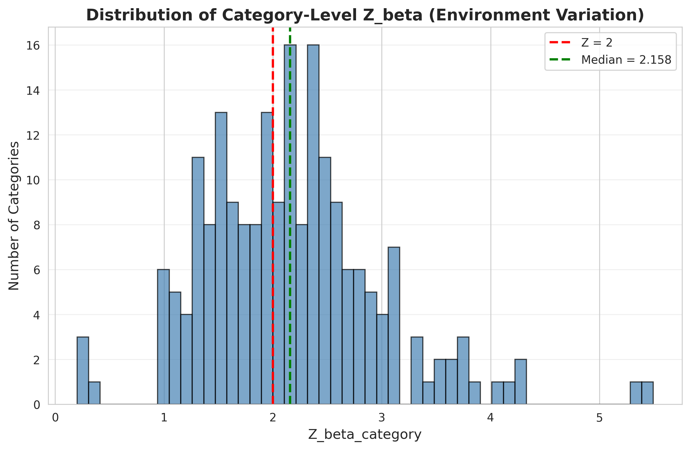

**Figure 5B: Category-Level Z-Score Distribution (Offsets)**  
*Description*: Histogram of $Z_{\beta,\text{category}}$ for all GO categories.  
*Interpretation*: Similar to Figure 5A but for offset parameters. Identifies categories with environment-specific baseline abundances. The distribution is similar to exponents, suggesting that both scaling and baseline levels vary by environment.


**Figure 6: Environment-Stratified Scaling (Log Scale)**  
*Description*: Faceted scatter plots showing scaling relationships for top 20 GO categories (by Z-score variance), with points colored by environment and separate fit lines per environment.  
*Interpretation*: Visualizes environment-specific scaling for categories with high Z-score variance. If environment-specific lines diverge, this confirms environment-dependent scaling. This is the most direct visualization of the core hypothesis: that scaling relationships differ between environments. The divergence of colored lines from the gray global fit confirms environment-specific patterns.


**Figure 6 (Linear Scale): Environment-Stratified Scaling**  
*Description*: Same as Figure 6 but in linear space.  
*Interpretation*: Linear-scale version shows actual scaling in natural units. The divergence of environment-specific curves is more visually apparent in linear space, making it easier to interpret the magnitude of environment-specific differences.

### Publication Figures


**Figure 7A: Z-Statistics for Exponents by Category**  
*Description*: Bar plot showing $Z_{\alpha,\text{category}}$ for each GO category, sorted by Z-score magnitude. Top categories are labeled with GO term names. Horizontal line: $|Z| = 2$ (significance threshold).  
*Interpretation*: Provides a ranked view of categories by environment-specific variation in scaling exponents. Categories with high $|Z_{\alpha,\text{category}}|$ are prime candidates for environment-specific scaling. The labeled categories (e.g., "phosphorelay signal transduction system", "DNA-binding transcription factor activity") represent functional groups that show strong environment-specific scaling patterns.

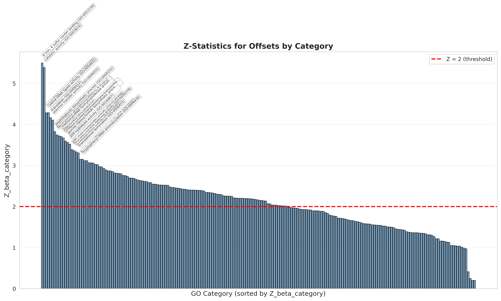

**Figure 7B: Z-Statistics for Offsets by Category**  
*Description*: Bar plot showing $Z_{\beta,\text{category}}$ for each GO category, sorted by Z-score magnitude.  
*Interpretation*: Similar to Figure 7A but for offset parameters. Identifies categories with environment-specific baseline abundances, independent of scaling exponent. Categories with high $|Z_{\beta,\text{category}}|$ have systematically different baseline levels across environments.

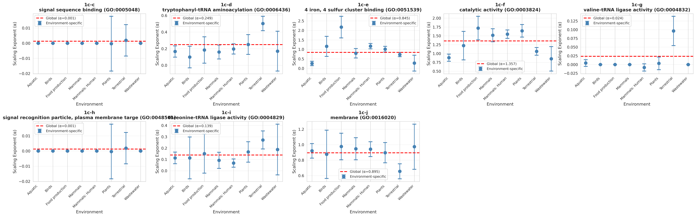

**Figure 7C-E: Exponent Comparisons for Selected Categories**  
*Description*: Faceted plots showing fitted exponents ($\alpha_{\text{env}}$) with 99% confidence intervals for selected GO categories across all environments. Horizontal dashed line: $\alpha_{\text{global}}$ (global exponent).  
*Interpretation*: Shows how scaling exponents vary across environments for representative categories. If confidence intervals don't overlap with the global exponent, this confirms environment-specific scaling. Categories are selected to represent the full range of Z-scores, providing both negative and positive examples. The variation in exponents across environments confirms that scaling is not universal but environment-dependent.

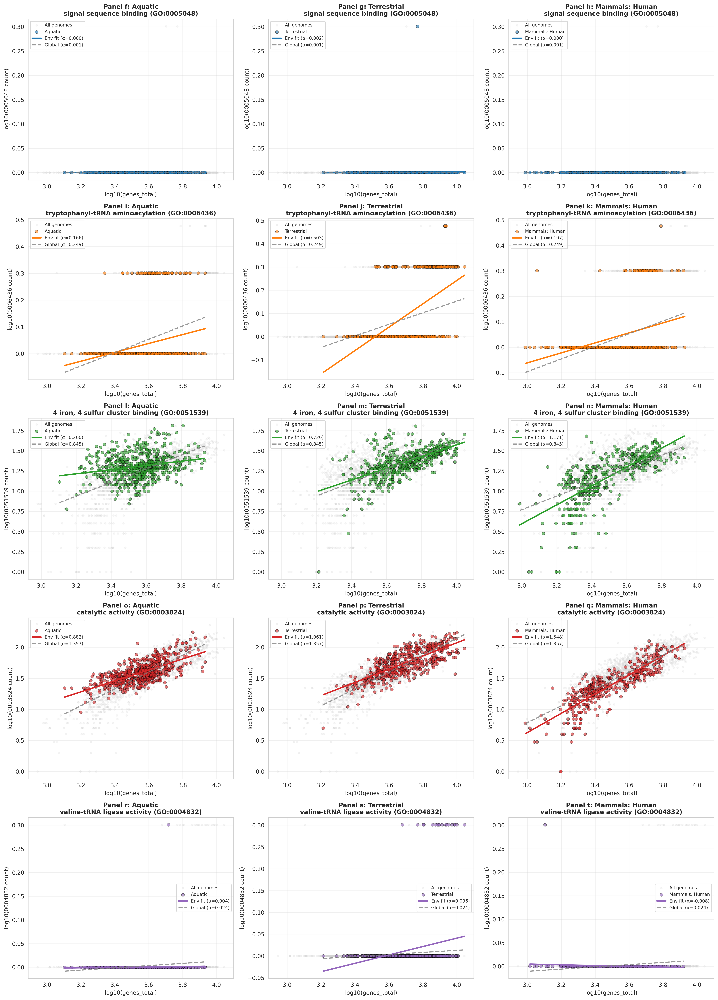

**Figure 7F-K: Scatter Plots with Environment-Specific Fits (Log Scale)**  
*Description*: Faceted scatter plots showing scaling relationships for selected categories and environments, with both global and environment-specific fits. Gray points: all genomes; Colored points: genomes from specific environment; Colored line: environment-specific fit; Gray line: global fit.  
*Interpretation*: Provides direct visual evidence of environment-specific scaling. If the colored line (environment-specific fit) deviates from the gray line (global fit), this confirms environment-dependent scaling. The selected combinations highlight categories with strong environment-specific patterns.

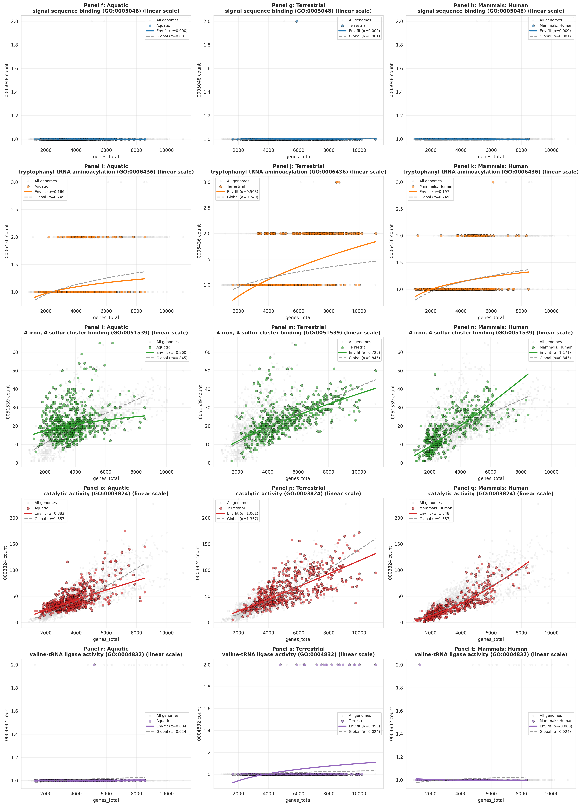

**Figure 7F-K (Linear Scale): Scatter Plots with Environment-Specific Fits**  
*Description*: Same as Figure 7F-K but in linear space.  
*Interpretation*: Linear-scale version is more interpretable for non-specialists, showing actual scaling in natural units. The deviation of environment-specific curves from the global curve is more visually apparent.

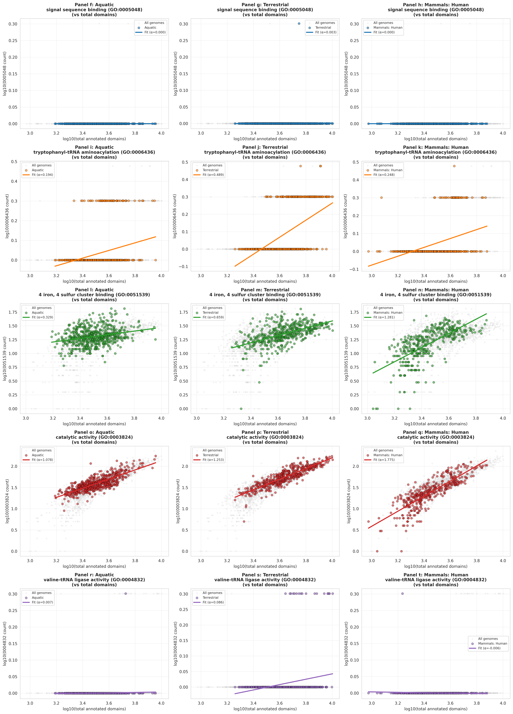

**Figure 8: GO Category Count vs. Total Annotated Domains (Log Scale)**  
*Description*: Faceted scatter plots showing relationship between GO category count and total annotated domains (sum of all GO counts per genome). Points colored by environment; lines show environment-specific fits.  
*Interpretation*: Tests whether category abundance scales with total functional diversity rather than just genome size. If scaling is similar to the `genes_total` plots, this suggests genome size is the primary driver. If scaling differs, this suggests functional diversity may be more relevant. This analysis helps distinguish between genome size effects and functional complexity effects.

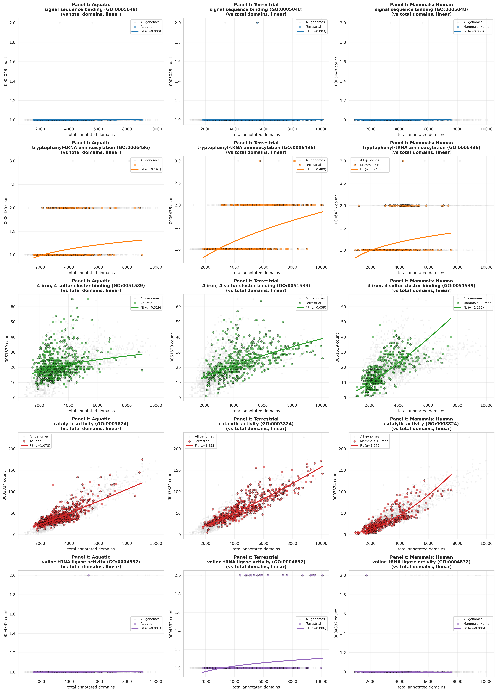

**Figure 8 (Linear Scale): GO Category Count vs. Total Annotated Domains**  
*Description*: Same as Figure 8 but in linear space.  
*Interpretation*: Linear-scale version shows the relationship in natural units, making it easier to interpret the magnitude of scaling.

---

## Results: Environment Prediction

### Model Performance Summary

| Model | Test Accuracy | Balanced Accuracy | Macro F1 | Weighted F1 | Status |
|-------|---------------|-------------------|----------|-------------|--------|
| Random Forest | **59.45%** | 40.30% | **0.4095** | **0.5728** | Best overall |
| XGBoost | **59.45%** | 39.49% | 0.4037 | 0.5672 | Comparable to RF |
| Gradient Boosting | 58.99% | 38.32% | 0.3907 | 0.5673 | Good performance |
| Logistic Regression | 48.85% | **41.38%** | 0.3952 | 0.4980 | Lower accuracy, better balanced |
| Baseline | 27.65% | 12.50% | 0.0542 | 0.1198 | Reference |

**Key Findings:**
- Models show overfitting (train accuracy ~98-100%, test ~59%)
- Random Forest and XGBoost perform best (~59% test accuracy)
- Top predictive features include GO terms (0003824, 0022857, 0016491) and `genes_total`
- Class imbalance: Birds (1.7%) and Wastewater (2.9%) are underrepresented
- All models outperform baseline (27.65% → 59.45%)


**Figure 9: Model Performance Comparison**  
*Description*: Four-panel comparison of model performance metrics: (1) Test accuracy by model, (2) Test balanced accuracy by model, (3) Macro F1-score by model, (4) Train vs. test accuracy (overfitting check).  
*Interpretation*: Random Forest and XGBoost achieve the highest test accuracy (59.45%), significantly outperforming the baseline (27.65%). However, balanced accuracy is lower (40.30%), reflecting challenges with minority classes. The overfitting check (panel 4) shows a large gap between train and test accuracy for tree-based models (37-41%), indicating potential overfitting. Logistic Regression shows less overfitting (20.8% gap) and better balanced accuracy (41.38%), suggesting it may generalize better despite lower overall accuracy.


**Figure 10: Confusion Matrices for All Models**  
*Description*: Normalized confusion matrices for all models (baseline, RF, GB, XGB, LR). Rows: true environment labels; Columns: predicted environment labels; Values: normalized proportions (percentages).  
*Interpretation*: 
- **Baseline**: Predicts only "Aquatic" (majority class) → 100% in first column, confirming class imbalance.
- **Tree-based models (RF, GB, XGB)**: Strong performance on "Aquatic" (80-85% accuracy), moderate on "Terrestrial" (56-60%) and "Mammals: Human" (58-73%), poor on rare classes ("Wastewater", "Birds") → often predicted as 0.
- **Logistic Regression**: More balanced predictions across classes, lower overall accuracy but better recall for minority classes.
- **Common confusions**: "Terrestrial" ↔ "Aquatic" (ecologically similar), "Mammals" ↔ "Mammals: Human" (taxonomically related), "Plants" ↔ "Terrestrial" (environmental overlap).


**Figure 11: ROC Curves (AUC) for All Models**  
*Description*: ROC curves for each model, showing one-vs-rest classification performance for each environment class. Diagonal dashed line: random classifier (AUC = 0.5).  
*Interpretation*: 
- **Aquatic**: Highest AUC (~0.85-0.90) across all models (largest class, most distinct features).
- **Terrestrial, Mammals: Human**: Moderate AUC (~0.70-0.80).
- **Rare classes (Wastewater, Birds)**: Lower AUC (~0.50-0.70) due to limited training data.
- **Mean AUC by model**: RF (~0.75), GB (~0.74), XGBoost (~0.75), LR (~0.72).
- All models show discriminative ability (AUC > 0.5), with best performance on majority classes.


**Figure 12: Per-Class Performance Metrics**  
*Description*: Four-panel heatmap showing per-class metrics across all models: (1) Precision by environment and model, (2) Recall by environment and model, (3) F1-score by environment and model, (4) Test set sample size by environment.  
*Interpretation*: 
- **Aquatic**: Highest precision/recall/F1 across all models (large class, distinct features).
- **Terrestrial, Mammals: Human**: Moderate performance.
- **Rare classes (Wastewater, Birds)**: Low precision/recall/F1 (limited training data, often predicted as 0).
- **Logistic Regression**: More balanced performance across classes (better recall for minority classes).
- The sample size panel (4) confirms class imbalance, with Aquatic having 60 test samples vs. Birds having only 3.


**Figure 13: Top 20 Feature Importances by Model**  
*Description*: Top 20 most important features for each model (RF, GB, XGB, LR), with annotated GO term labels instead of numeric IDs.  
*Interpretation*: 
- **Top features across models**:
  1. **Catalytic activity (GO:0003824)**: Most important in RF, GB, LR. Broad functional category (many enzymes).
  2. **Transmembrane transporter activity (GO:0022857)**: High importance in RF, GB, XGB. Environment-specific nutrient/ion transport.
  3. **Oxidoreductase activity (GO:0016491)**: High importance in RF, GB, XGB. Metabolic diversity indicator.
  4. **Genome size (`genes_total`)**: Moderate importance across models. Confirms genome size is predictive of environment.
  5. **Total annotated GO domains (`go_total`)**: Moderate importance. Overall functional complexity indicator.
- **Biological interpretation**: Transporters and metabolic enzymes are most predictive, suggesting that environment-specific nutrient acquisition and metabolic pathways are key discriminators. Genome size also contributes, confirming that environment constrains genome size.

---

## Metabolic GO Categories Analysis

### Metabolic Terms Selection

Metabolic GO terms were identified by traversing the GO ontology DAG starting from metabolism-related root terms:
- GO:0008152 (metabolic process)
- GO:0044281 (small-molecule metabolic process)
- GO:0006520 (amino acid metabolic process)
- GO:0009056 (catabolic process)
- GO:0009058 (biosynthetic process)

**Result**: 173 metabolic GO terms out of 208 total (99% prevalence threshold).

### Metabolic Scaling Patterns

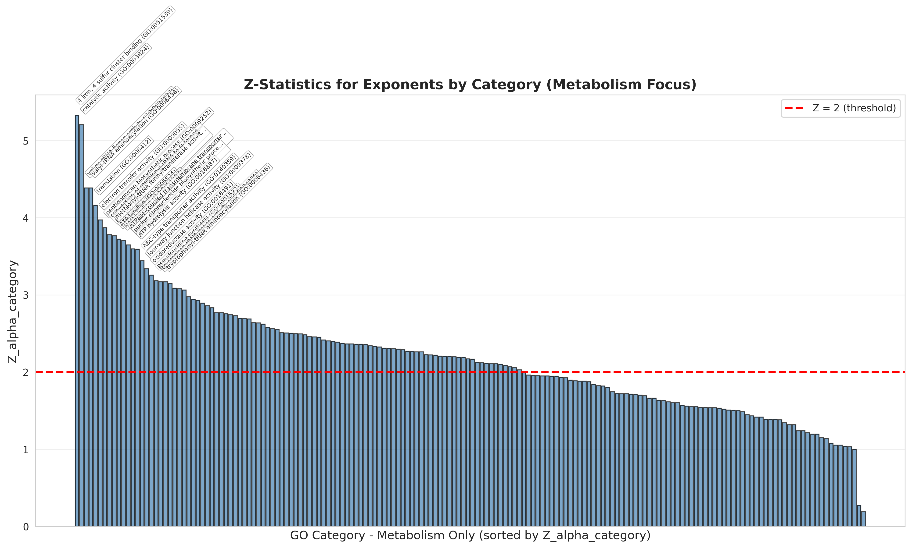

**Figure 14: Metabolic GO Categories - Z-Statistics for Exponents**  
*Description*: Bar plot showing $Z_{\alpha,\text{category}}$ for metabolism-related GO categories only, sorted by Z-score magnitude.  
*Interpretation*: Focuses on metabolic functions to test whether metabolism shows environment-specific scaling. Categories with high $|Z|$ indicate that metabolic pathways scale differently across environments, supporting the hypothesis that nutrient availability constrains metabolic gene content. The distribution shows that many metabolic categories have significant environment-specific variation (|Z| > 2), confirming that metabolic scaling is environment-dependent.


**Figure 15: Metabolic GO Categories - Representative Scaling (Log Scale)**  
*Description*: Faceted scatter plots showing log-log fits for top metabolic GO categories.  
*Interpretation*: Visual validation of power-law scaling for metabolic terms. The linear relationships in log-log space confirm that metabolic gene content scales with genome size. Categories selected for display show high Z-score variance, indicating environment-specific metabolic patterns.


**Figure 15 (Linear Scale): Metabolic GO Categories - Representative Scaling**  
*Description*: Same as Figure 15 but in linear space.  
*Interpretation*: Linear-scale version shows actual metabolic scaling in natural units. The curves show how metabolic gene counts grow with genome size, with most categories showing near-linear scaling (α ≈ 1).


**Figure 16: Metabolic GO Categories - Environment-Stratified Scaling (Log Scale)**  
*Description*: Faceted scatter plots showing scaling relationships for top metabolic categories, with points colored by environment and separate fit lines per environment.  
*Interpretation*: Visualizes environment-specific metabolic scaling. The divergence of environment-specific lines confirms that metabolic pathways scale differently across environments. This supports the hypothesis that nutrient availability and metabolic requirements vary by environment, leading to environment-specific metabolic gene content.


**Figure 16 (Linear Scale): Metabolic GO Categories - Environment-Stratified Scaling**  
*Description*: Same as Figure 16 but in linear space.  
*Interpretation*: Linear-scale version shows environment-specific metabolic scaling in natural units. The divergence of curves is more visually apparent, making it easier to interpret the magnitude of environment-specific metabolic differences.

---

## Discussion and Interpretation

### Key Findings

#### 1. Power-Law Scaling is Universal but Environment-Specific

- **Global scaling**: Most GO categories show near-linear scaling (α ≈ 1), indicating proportional growth with genome size.
- **Environment-specific variation**: Z-statistics reveal significant environment-specific deviations (|Z| > 2) for many categories.
- **Implication**: Functional gene content scales with genome size, but the scaling relationship is modulated by environment.

#### 2. Environment Can Be Predicted from Genomic Features

- **Prediction accuracy**: 59.45% test accuracy (Random Forest/XGBoost), significantly better than baseline (27.65%).
- **Top predictive features**: Catalytic activity, transmembrane transporters, oxidoreductases, and genome size.
- **Implication**: Genomic features contain sufficient information to predict environment, suggesting environment-specific functional requirements.

#### 3. Metabolic Pathways Show Environment-Specific Scaling

- **Metabolic Z-scores**: Many metabolic categories show significant environment-specific variation (|Z| > 2).
- **Biological interpretation**: Nutrient availability and metabolic requirements vary by environment, leading to environment-specific metabolic gene content.
- **Implication**: Metabolism is a key driver of environment-specific functional constraints.

### Biological Interpretation

#### Transporters and Nutrient Acquisition

The high importance of **transmembrane transporter activity (GO:0022857)** in environment prediction suggests that nutrient acquisition strategies are environment-specific:
- **Aquatic environments**: May require specific ion transporters (e.g., salt tolerance).
- **Host-associated environments**: May require transporters for host-derived nutrients.
- **Terrestrial environments**: May require transporters for soil-derived nutrients.

#### Metabolic Diversity

The importance of **oxidoreductase activity (GO:0016491)** and other metabolic enzymes suggests that metabolic diversity is environment-specific:
- **Aerobic vs. anaerobic**: Different environments require different electron acceptors.
- **Carbon sources**: Different environments provide different carbon sources (e.g., plant-derived vs. animal-derived).
- **Nitrogen metabolism**: Different environments have different nitrogen availability (e.g., N₂ fixation vs. organic N).

#### Genome Size Constraints

The moderate importance of **genome size (`genes_total`)** confirms that environment constrains genome size:
- **Small genomes**: May be favored in nutrient-limited environments (reduced maintenance costs).
- **Large genomes**: May be favored in stable, nutrient-rich environments (increased functional diversity).
- **Host-associated**: May show intermediate sizes (balance between functional diversity and efficiency).

### Limitations and Future Directions

#### Limitations

1. **Class Imbalance**: Rare environments (Birds, Wastewater) have limited training data, leading to poor prediction performance.
2. **Overfitting**: Tree-based models show significant overfitting (train accuracy ~98%, test ~59%), suggesting need for regularization or hyperparameter tuning.
3. **Phylogenetic Confounding**: Genomes are not independent (shared evolutionary history), potentially inflating significance of Z-scores.
4. **Annotation Bias**: GO annotation completeness varies by environment, potentially confounding predictions.
5. **Environment Classification**: GOLD metadata may not capture all relevant environmental variation.

#### Future Directions

1. **Hyperparameter Tuning**: Grid search or Bayesian optimization to reduce overfitting.
2. **Feature Engineering**: Include lower-prevalence GO terms, taxonomic features, GC content, mobile elements.
3. **Class Balancing**: Oversampling minority classes (SMOTE) or cost-sensitive learning.
4. **Phylogenetic Awareness**: Phylogenetic cross-validation or phylogenetic features.
5. **Interpretability**: SHAP values, partial dependence plots, model-agnostic explainability.

---

## Conclusions

### Summary

This study demonstrates that:

1. **Functional gene content scales with genome size** following power-law relationships, with most categories showing near-linear scaling (α ≈ 1).

2. **Scaling relationships are environment-specific**, with significant deviations (|Z| > 2) for many GO categories, indicating that environment modulates functional constraints.

3. **Environment can be predicted from genomic features** with 59.45% accuracy, significantly better than baseline (27.65%), using GO term counts and genome size.

4. **Metabolic pathways show strong environment-specific scaling**, supporting the hypothesis that nutrient availability constrains metabolic gene content.

5. **Top predictive features** (transporters, metabolic enzymes, genome size) align with biological expectations, suggesting that nutrient acquisition and metabolism are key drivers of environment-specific functional constraints.

### Biological Implications

- **Environment constrains genome size** through functional requirements (nutrient acquisition, metabolism, regulation).
- **Functional diversity scales with genome size**, but the scaling relationship is modulated by environment-specific constraints.
- **Metabolic pathways are environment-specific**, reflecting nutrient availability and metabolic requirements.
- **Genomic features contain sufficient information** to predict environment, suggesting strong environment-genome relationships.

### Methodological Contributions

- **Power-law scaling framework** provides a quantitative approach to studying genome size constraints.
- **Z-statistics** enable rigorous quantification of environment-specific deviations.
- **Supervised machine learning** demonstrates predictive power of genomic features for environment classification.
- **99% prevalence threshold** focuses on ubiquitous terms while maintaining feature diversity.

---

## References

- van Nimwegen, E. (2003). Scaling laws in the functional content of genomes. *Trends in Genetics*, 19(9), 479-484.
- Breiman, L. (2001). Random forests. *Machine Learning*, 45(1), 5-32.
- Chen, T., & Guestrin, C. (2016). XGBoost: A scalable tree boosting system. *Proceedings of the 22nd ACM SIGKDD International Conference on Knowledge Discovery and Data Mining*, 785-794.
- Gene Ontology Consortium. Gene Ontology annotations and ontology structure.
- GOLD (Genomes OnLine Database) for environment metadata.

---

**Document Version**: 1.0  
**Last Updated**: 2024  
**Analysis Date**: 2024  
**Prevalence Threshold**: 99%  
**Total Genomes**: 2,164  
**GO Terms Analyzed**: 208  
**Metabolic GO Terms**: 173

